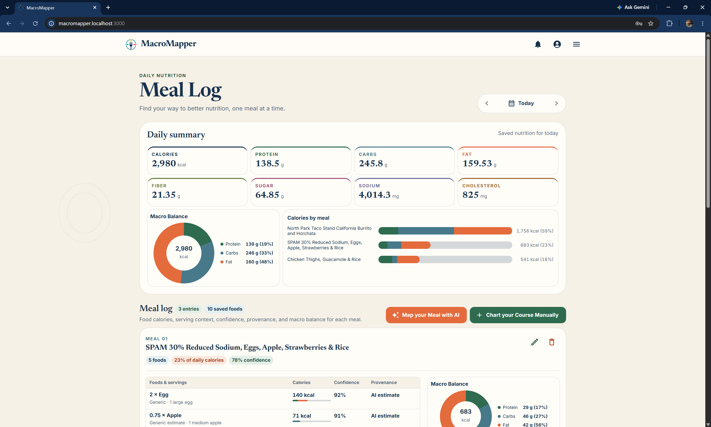
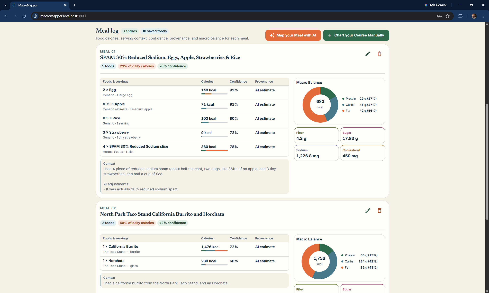
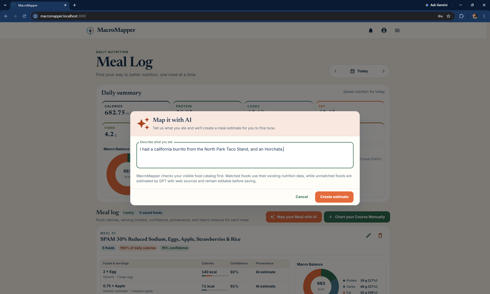
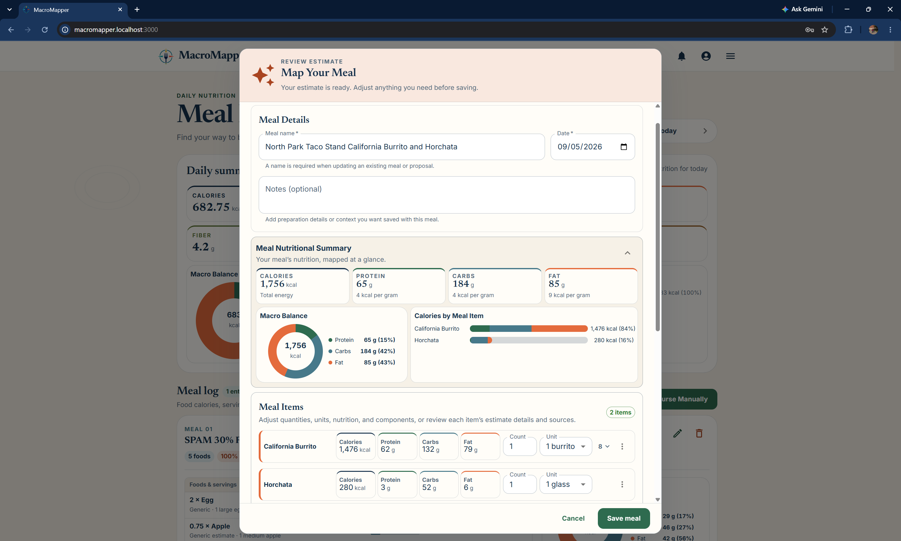
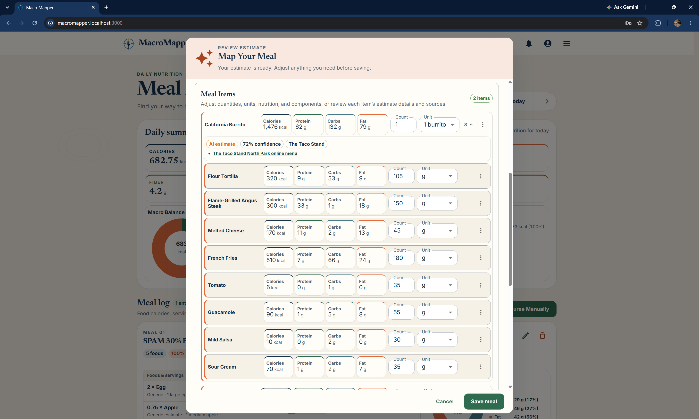
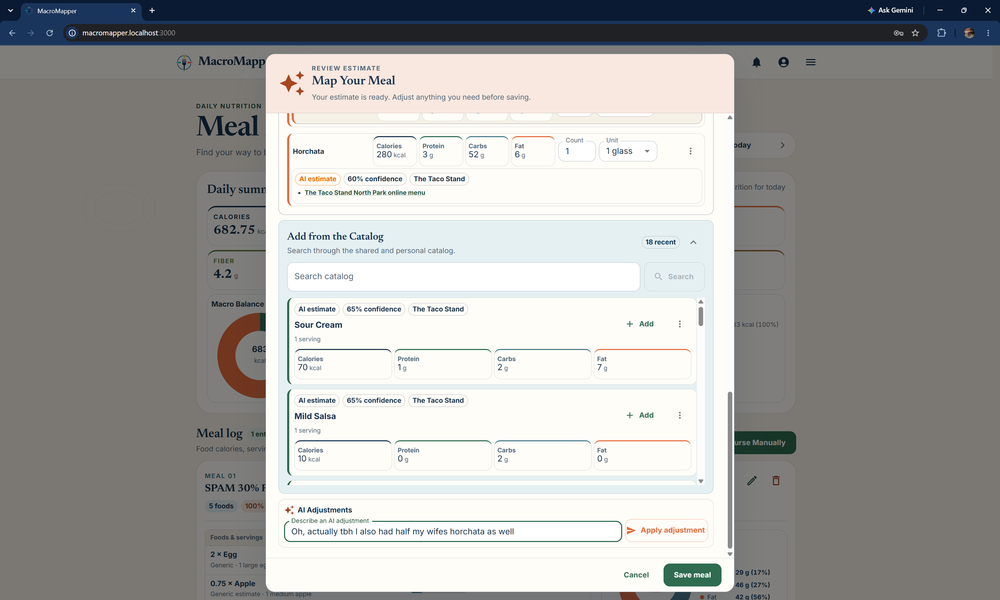

# 🥗 MacroMapper
**A Source-Aware Nutrition and Activity Tracker**

MacroMapper is a personal nutrition and activity tracker for people who want a
fast diary without hiding how meal estimates were created. Users can log food
manually or describe a meal in natural language, review an editable GPT
estimate with its sources, and decide what enters their history.

It is inspired by MyFitnessPal's quick daily logging experience, with a
transparent Food Item catalog that can break meals into reusable components.
MacroMapper tracks nutrition and activity information without providing
medical, clinical, or prescriptive dietary advice.

The authentication, application, Food Item catalog, private meal diary, and
GPT-assisted meal-estimation flows are implemented. Activity and goal features
remain planned in the [product roadmap](docs/PRODUCT_VISION.md).

## 👋 A Note from the Author

First and foremost, I created this application because I wanted a calorie
counting app. I used to use MyFitnessPal, but I wanted something AI-powered,
and all the options were around $20 a month. I also didn't want to take
pictures of my food. I mean, I feel like that would give you the worst estimate
of all time.

I had a vision where you'd write a description, then the app would do its best
to fact-check it against the internet. If I said I had a Double-Double Animal
Style with no lettuce (this is an example—I love lettuce) from In-N-Out, it
would find the nutrition facts, figure out what Animal Style adds, break the
meal down into components, and remove the lettuce. That information would then
be available to everyone using the application, along with a confidence level,
the actual source, and a provenance label.

Outside of that, my goal was to build a useful personal application that uses
generative AI in a way you can trust and audit.

MacroMapper also builds on lessons from my earlier projects. Notoli taught me
how to deploy and maintain a full-stack application, and it introduced the
personality-driven GPT GitHub reviewers I use as a merge gate. I then created
FullStackTemplate to capture the pieces I wanted to reuse—authentication,
email, CI/CD reviewers, deployment, and the base Django/React scaffolding—so I
could focus MacroMapper on nutrition tracking and source-aware estimation.

## ✨ Features
- **Account foundation:** email-first registration, JWT sessions, password
  reset, protected routes, and recipient-scoped notifications
- **Private meal diary:** dated meal entry creation, editing, deletion, durable
  saved food/component details, and daily launch-nutrient totals
- **GPT meal proposals:** fast deterministic catalog reuse followed by
  structured AI food-intent extraction when a description remains unresolved;
  each extracted food is searched independently and only missing foods receive
  a sourced nutrition estimate. Conversational follow-up additions and
  corrections stay within the editable, source-aware proposal with explicit
  provenance, immutable review revisions, and confidence requiring review
  before saving.
- **Reusable Food Items:** authenticated catalog APIs for standalone and
  composite foods with portions, nutrients, provenance, sources, and confidence
- **Catalog separation:** initial AI definitions become deduplicated shared
  catalog records, while user-adjusted and fully personal records remain
  attributable and private
- **Goals and trends (planned):** nutrition targets, activity-adjusted budgets,
  and factual daily, weekly, and monthly reporting
- **Same-origin routing:** React at `/`, authentication at `/auth/`, application
  APIs at `/api/`, and Django admin at `/admin/`
- **Dockerized deployment:** frontend, backend, and Nginx reverse proxy with
  local HTTPS and production-oriented configuration

## 🚀 Tech Stack
- **Backend:** Django + Django REST Framework
- **Frontend:** React + Vite + Material UI
- **Authentication:** Simple JWT
- **Testing:** Django test runner + Vitest + Testing Library
- **Code quality:** Ruff + ESLint + Prettier
- **Deployment:** Docker + Nginx
- **Hosting:** DigitalOcean
- **DNS/Proxy:** Cloudflare
- **Email:** Resend
- **CI/CD & Workflows:** GitHub Actions
- **Security automation:** CodeQL, dependency and malware review, Dependabot,
  blocking AI PR reviewer verdicts enforced through required checks, and
  scheduled security-alert aggregation

## 📸 Application Tour

### Daily Nutrition Page 01

View your daily statistics.

### Daily Nutrition Page 02

View your meal-by-meal stats as well as their confidence and provenance.

### Meal Estimation Page 01

Estimate your meal with AI!

### Meal Estimation Page 02

The nutritional information for your meal!

### Meal Estimation Page 03

Break down meal items by component for easy adjustments—like, “Oh! I actually
didn't have sour cream.” The app also displays the provenance, source, and
confidence.

### Meal Estimation Page 04

Manually add items from the catalog, or use AI to make adjustments!

## 📚 Documentation
- Product vision and delivery roadmap: [`docs/PRODUCT_VISION.md`](docs/PRODUCT_VISION.md)
- Setup, environment variables, and common commands: [`AGENTS.md`](AGENTS.md)
- Backend (API, auth, configuration): [`backend/README.md`](backend/README.md)
- Frontend (routing, sessions, API base URL): [`frontend/README.md`](frontend/README.md)
- Deployment (Docker, Nginx, Cloudflare, DigitalOcean): [`deploy/README.md`](deploy/README.md)
- GitHub Apps, Project, and repository settings: [`docs/GITHUB_SETUP.md`](docs/GITHUB_SETUP.md)
- CI/CD and automation: [`.github/README-WORKFLOWS.md`](.github/README-WORKFLOWS.md)
- Changelog: [`CHANGELOG.md`](CHANGELOG.md)

## 📜 License
This project is licensed under a **Modified MIT License (Non-Commercial Use
Only)**. See [`LICENSE.md`](LICENSE.md) for full details.

## 🙏 Acknowledgments
This project includes code derived from
[`conda_export.py`](https://github.com/andresberejnoi/Conda-Tools) by
**Andres Berejnoi**, used under the terms of the original
[MIT License](https://opensource.org/licenses/MIT).
