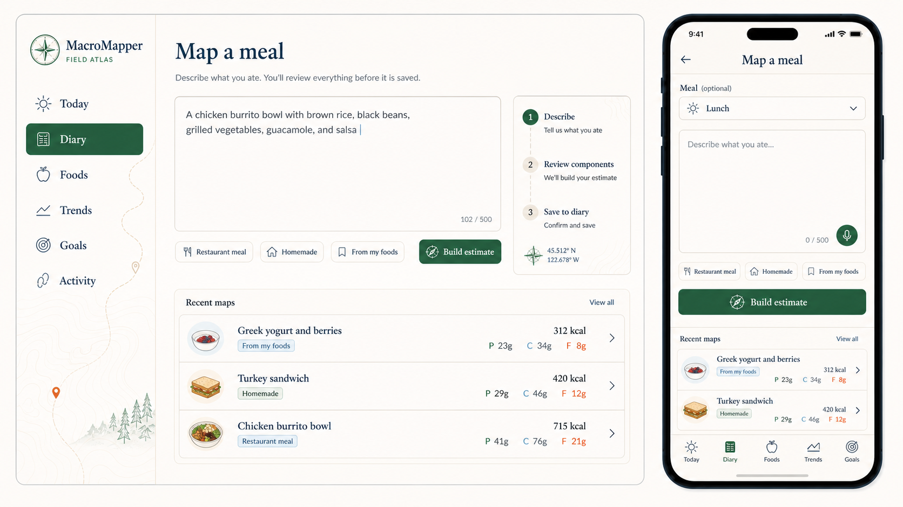
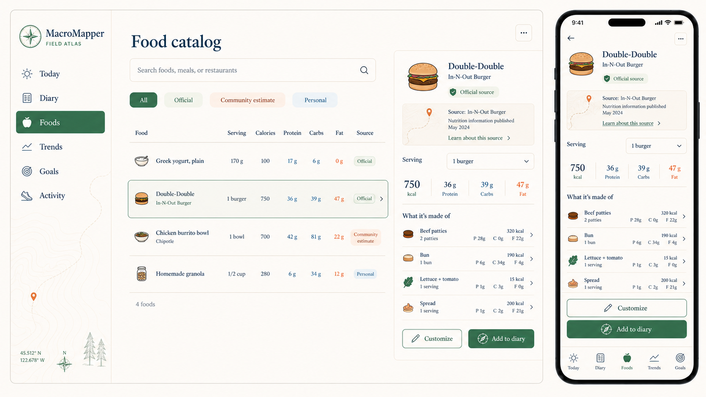
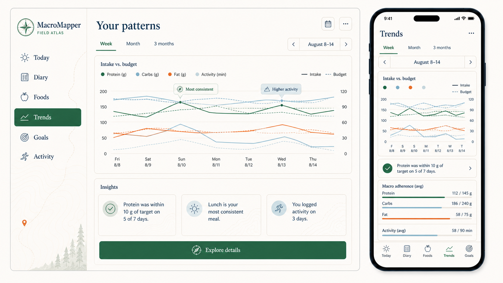
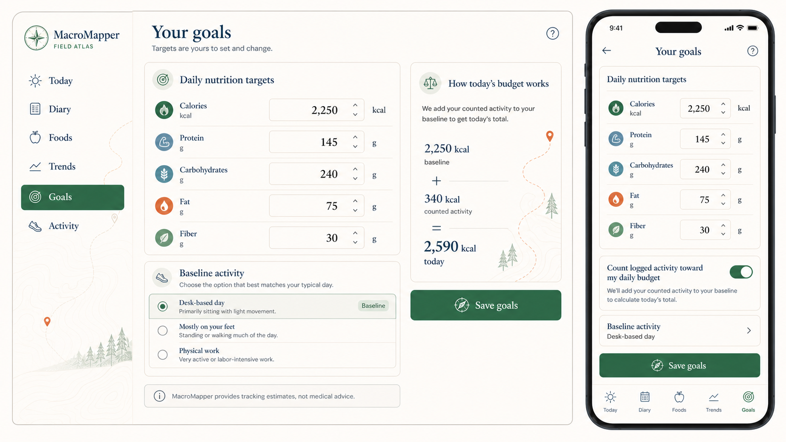
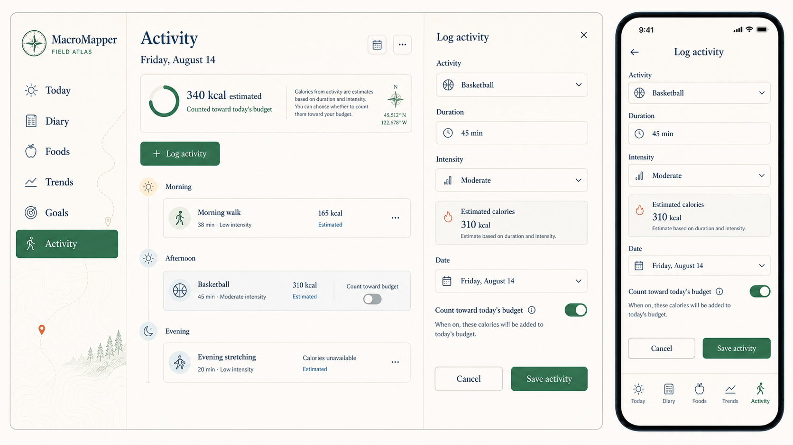

# 🧭 Field Atlas design direction

Field Atlas is MacroMapper's recommended product identity. It turns the idea of
"mapping a meal" into a quiet interface language: users describe food, inspect
the route from source to estimate, adjust components, and choose what becomes
part of their diary.

The system should feel editorial and grounded rather than clinical, athletic,
or gamified. Cartographic details provide orientation and provenance; they are
not decoration applied to every card.

## 🌿 Brand character

- **Clear:** show how totals were built and what can be changed.
- **Grounded:** favor warm paper surfaces, ink lines, and factual language.
- **Exploratory:** frame estimates as routes the user can inspect and correct.
- **Calm:** avoid alarm colors for ordinary target variation.
- **Personal:** a saved meal is the user's accepted version, not a canonical
  correction to the shared catalog.

## 🎨 Core palette

| Role | Token | Value | Typical use |
| --- | --- | --- | --- |
| Canvas | Bone | `#F6F1E7` | Page background and large surfaces |
| Primary text | Midnight ink | `#17324D` | Headings, body text, borders, calorie totals |
| Confirmed | Forest | `#2E6B4F` | Primary actions, saved/official states, protein |
| Editable estimate | Persimmon | `#E46B3C` | Estimated values, edit emphasis, fat |
| Neutral data | Mineral blue | `#A9CAD4` | Carbohydrates, activity, supporting charts |

Use tints of the five core colors before adding new hues. Status must never be
communicated by color alone: pair it with a label and an icon.

## ✍️ Typography

- Use a confident editorial serif for page titles, meal names, dates, and key
  totals. The mockups use a Canela-like voice; `Newsreader` or `Source Serif 4`
  are practical open-source implementation candidates.
- Use `Inter` for navigation, controls, labels, tables, and long-form text.
- Use tabular numerals for nutrients, quantities, dates, and charts.
- Keep sentence case throughout. Avoid all-caps except tiny provenance stamps.

## 🧱 Shape and surface

- Use 1 px midnight-ink borders at low opacity to define structure.
- Prefer 10–14 px corner radii. Primary controls may be slightly softer; data
  tables and drawers should remain more architectural.
- Use almost no elevation. Separate layers through border, spacing, and subtle
  warm/cool surface shifts.
- Keep 44 px minimum interactive targets and generous vertical rhythm.

## 🗺️ Cartographic language

- **Compass:** orientation, active steps, and primary mapping actions.
- **Route line:** progress from description to reviewed meal to saved diary.
- **Map pin:** provenance, sources, and the point where an estimate originated.
- **Coordinates:** optional brand signature in empty rails and low-density
  surfaces; never imply the user's real location.
- **Contour lines:** background texture only, at very low contrast. Do not place
  them behind tables, form fields, or charts.

## 📊 Data and state language

- Calories use Midnight ink, protein uses Forest, carbohydrates use the dark
  Mineral token `#47798A`, and fat uses Persimmon across diary, estimate review,
  food detail, goals, and trends. Calorie charts use Midnight ink rather than a
  macro color; pale Mineral remains available for neutral data surfaces.
- Component calorie bars use total length for each component's calorie share
  and stacked macro colors for its protein-, carbohydrate-, and fat-derived
  calories. Use Midnight ink when a complete macro split is unavailable.
- Activity uses a deeper mineral-blue tint and always labels calorie values as
  estimates.
- Official, Community estimate, and Personal records receive icon + text badges.
- Unknown nutrients display `Unavailable`, never `0`.
- Use wording such as `within target`, `above target`, and `below target` rather
  than success/failure language.

## 📱 Responsive shell

- Desktop uses a persistent 240–264 px left rail and a flexible content canvas.
- Detail-heavy pages may open a right-side inspector without losing list context.
- Mobile uses a compact title bar and five-item bottom navigation. Secondary
  sections such as Activity can replace the least-used tab contextually or live
  under an overflow destination.
- Primary actions remain near the bottom of mobile forms and are never hidden
  behind fixed navigation.

## 🖼️ Page concepts

### ☀️ Today and estimate review

The original direction establishes the daily budget, meal sections, and the
editable source-aware estimate review.

### 🧭 Map a meal

Natural-language logging is framed as a three-step route: Describe, Review
components, Save to diary. Recent meals provide fast repeat logging.

### 🍎 Food catalog

The catalog keeps provenance beside every result and uses a persistent detail
inspector for composite foods.

### 📈 Trends

Charts use restrained semantic colors and factual annotations. Insight cards
describe patterns without praise, blame, or medical interpretation.

### 🎯 Goals

Targets stay directly editable. The budget equation explains exactly how
counted activity changes the day without presenting the calculation as advice.

### 🏃 Activity

Activity entries separate recording an event from deciding whether its estimated
calories count toward the food budget.

## 💬 Signature product language

- `Map this meal` — begin estimate creation from the diary.
- `Build estimate` — submit a natural-language meal description.
- `Review components` — inspect quantities, sources, and confidence.
- `Save to diary` — accept the user's edited snapshot.
- `Recent maps` — recent or repeatable meal descriptions.
- `Your patterns` — factual trends without clinical interpretation.

These phrases make the product memorable, but mapping language should remain
concentrated around meal creation and provenance. Ordinary settings and actions
should continue to use plain language.
