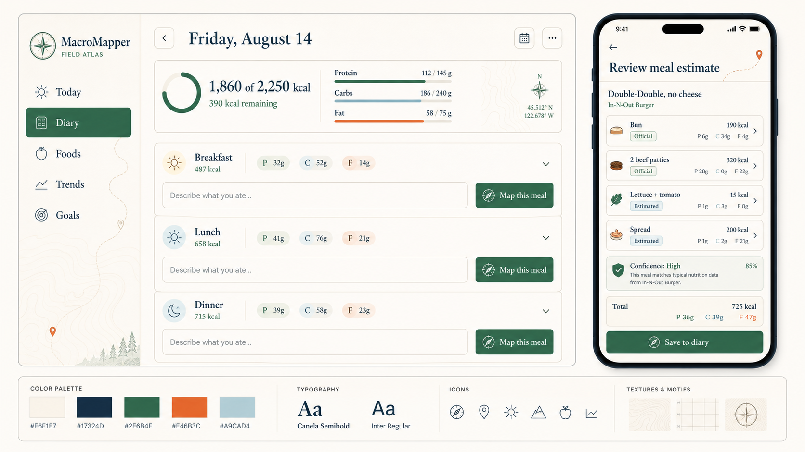
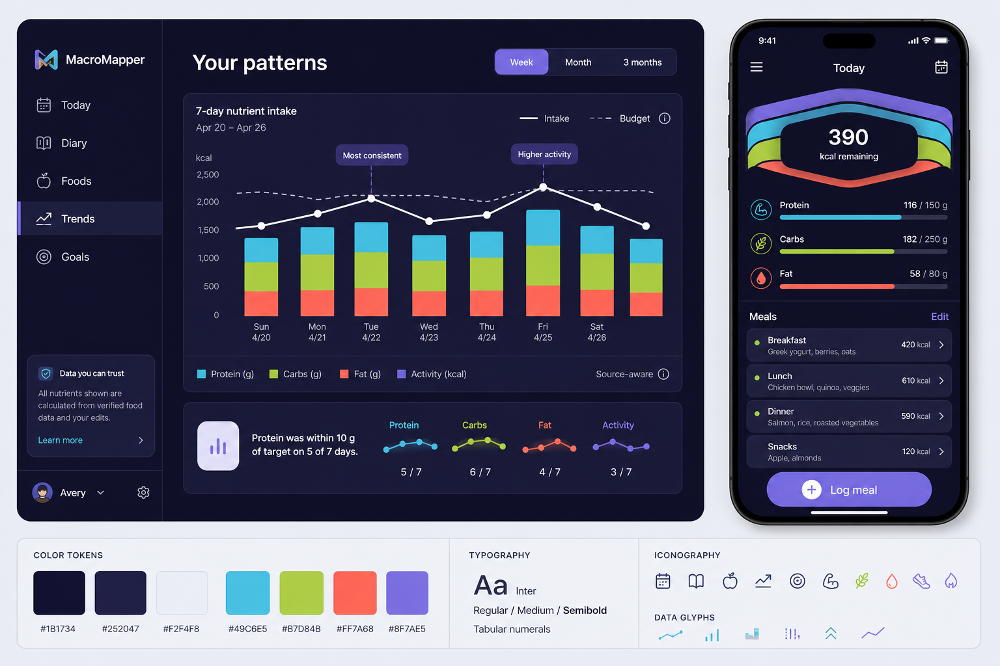
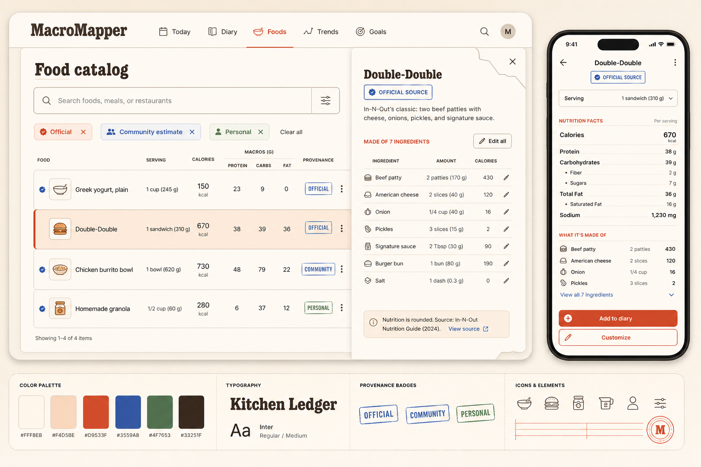

# MacroMapper visual theme concepts

These directions translate MacroMapper's product promise—fast logging with
editable, source-aware nutrition estimates—into distinct visual systems. They
intentionally move away from the inherited dark, pale-yellow, and amber Notoli
template palette.

## Recommended direction: Field Atlas

Field Atlas makes the "Mapper" in MacroMapper meaningful without turning the
product into outdoor-adventure branding. Fine contour lines, coordinates,
compass cues, and editorial typography frame each meal as something the user
can inspect and map. The restrained green, mineral blue, and persimmon accents
feel food-adjacent while keeping the interface calm and trustworthy.

- Bone: `#F6F1E7`
- Midnight ink: `#17324D`
- Forest: `#2E6B4F`
- Persimmon: `#E46B3C`
- Mineral blue: `#A9CAD4`
- Best fit: daily diary, GPT meal review, source/confidence explanations
- Watch-out: keep cartographic motifs sparse so they remain a brand layer, not
  visual noise

See the expanded [Field Atlas design direction](./FIELD_ATLAS.md) for the full
visual system and additional responsive page concepts.

## Alternative: Nutrient Spectrum

Nutrient Spectrum treats macro colors as a disciplined data language. It is
the strongest direction for trends and dense tracking screens, with a more
technical and energetic personality than Field Atlas. Dark aubergine avoids
the inherited charcoal look; cyan, chartreuse, coral, and violet always map to
specific nutrient or activity categories.

- Deep aubergine: `#1B1734`
- Raised surface: `#252047`
- Mist: `#F2F4F8`
- Protein cyan: `#49C6E5`
- Carbs chartreuse: `#B7D84B`
- Fat coral: `#FF7A68`
- Activity violet: `#8F7AE5`
- Best fit: trends, budget status, high-density mobile summaries
- Watch-out: avoid neon effects and gradients that weaken data clarity

## Alternative: Kitchen Ledger

Kitchen Ledger makes provenance and composition tangible through ruled grids,
recipe-card structure, and stamped trust states. It is practical, warm, and
especially strong for the Food Item catalog. Its slab-serif voice is the most
characterful of the three directions.

- Warm cream: `#FFF8EB`
- Espresso: `#33251F`
- Tomato: `#D9533F`
- Cobalt: `#3559A8`
- Leaf green: `#4F7653`
- Pale peach: `#F4D5BE`
- Best fit: food search, composite foods, nutrition details, provenance badges
- Watch-out: keep the recipe-card language crisp enough to avoid farmhouse or
  scrapbook styling

## Shared interaction principles

- Make meal estimates proposals, never mysterious final answers.
- Keep components, quantities, nutrient totals, sources, and confidence visible
  in the same review flow.
- Use neutral language for progress. Reserve urgent color for actual errors,
  not ordinary nutrition variance.
- Use one stable color per macro across diary, food detail, and trends.
- Show unknown nutrients as unavailable rather than zero.
- Keep the primary daily action phrased as `Map this meal`; it is both useful
  microcopy and a distinctive brand verb.

## Suggested next step

Prototype Field Atlas first across four responsive screens: Today/Diary, Review
meal estimate, Food details, and Trends. Borrow Nutrient Spectrum's categorical
macro colors in a softened form, while retaining Field Atlas's typography,
surfaces, and navigation.
